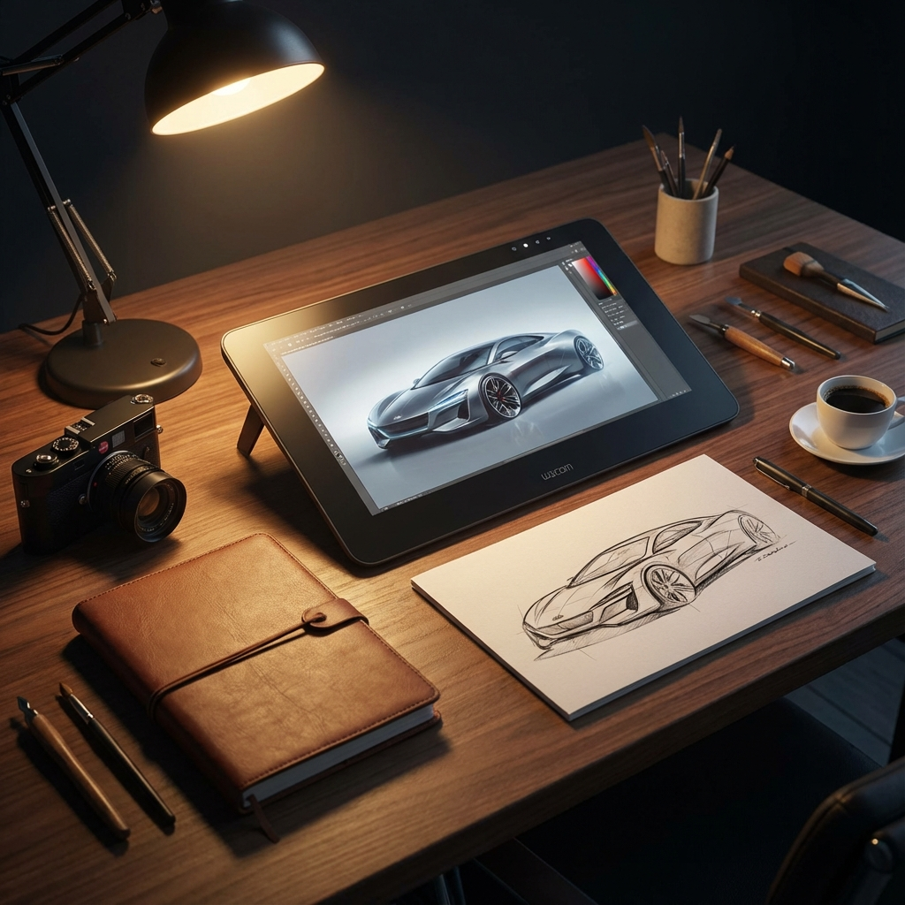
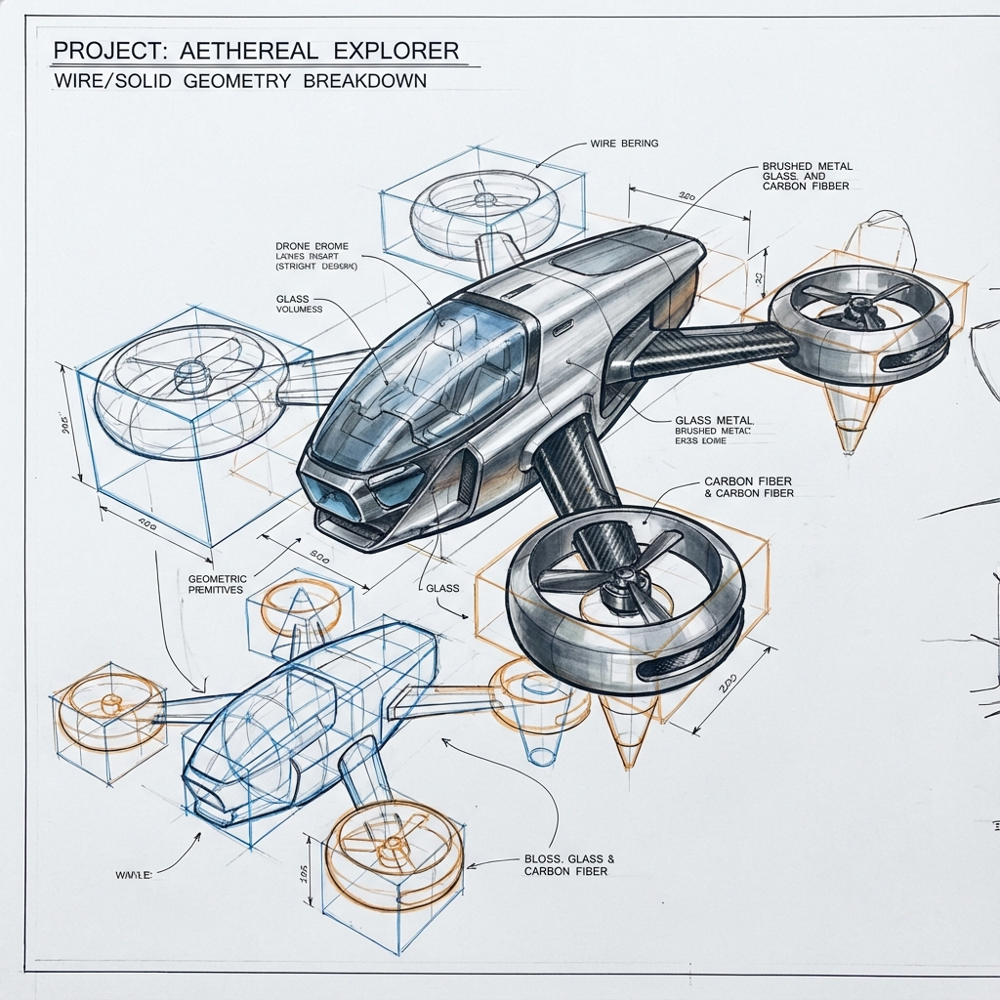
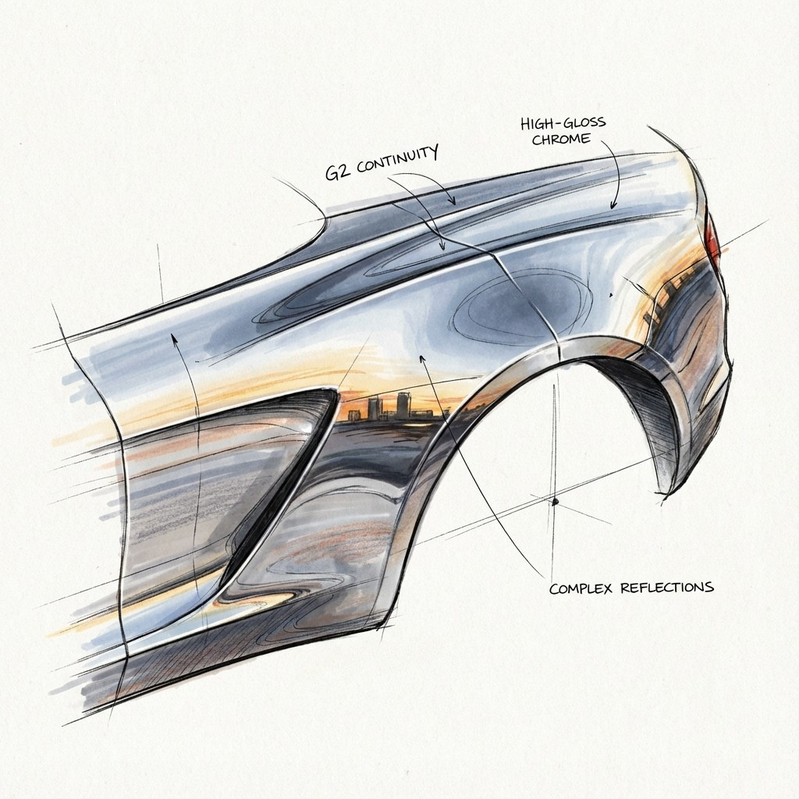
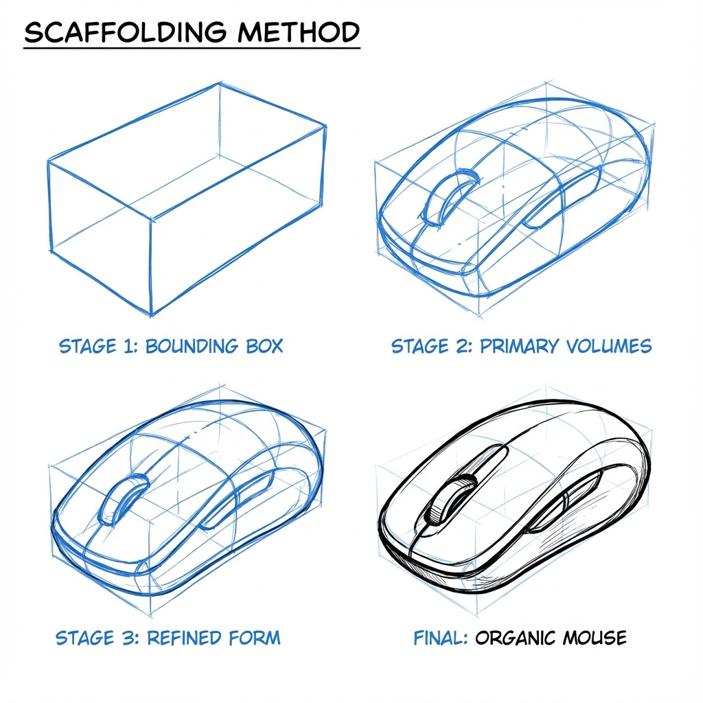
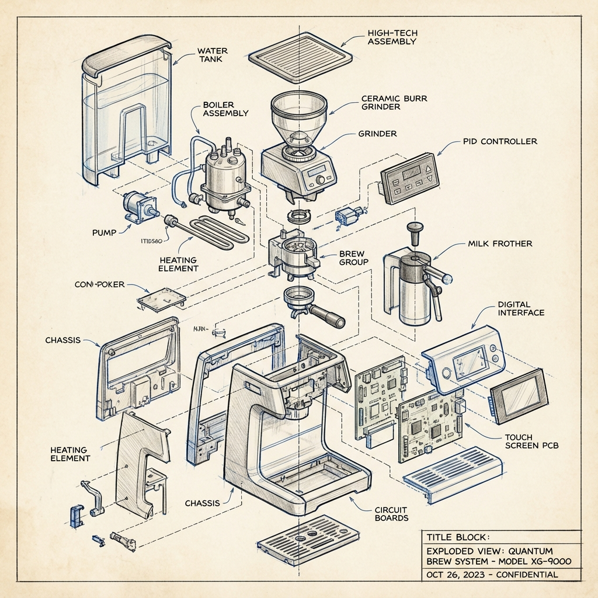

# 🎨 El Arte y la Ciencia del Bocetado
### *Manual del Sketcher Profesional: De la Idea al Render*

Este repositorio contiene la versión digital de **Super Sketching**, una guía integral diseñada para diseñadores industriales, artistas conceptuales y entusiastas del pensamiento visual. El manual fusiona la técnica analógica tradicional con las herramientas más avanzadas de IA y visualización 3D.

---

## 🚀 Acceso Rápido

- 🌐 [**Ver Versión Web**](index.html) - Lector interactivo optimizado.
- 📄 [**Generar Libro en PDF**](index.html?print=true) - Versión lista para imprimir en A4.
- 📢 [**Página Promocional**](landing.html) - Landing page con resumen visual.

---

## 📔 Estructura del Libro

El libro está dividido en 5 partes fundamentales que cubren todo el espectro del diseño visual:

### 1. Fundamentos y Mentalidad
- **El Porqué del Boceto:** La rapidez de ideación frente a la IA.
- **Herramientas:** Bolígrafos de punta de aguja, papel layout y ergonomía.
- **La Línea:** El rastro visible del pensamiento.

### 2. Proyección y Perspectiva
- **Sistema Ortográfico:** El lenguaje de la verdad sin distorsión.
- **Perspectiva:** Construcción de la ilusión tridimensional.
- **Geometrías:** Elipses, planos inclinados y semántica de las formas.

### 3. Construcción y Volumetría
- **Andamiaje (Scaffolding):** De la caja base a la forma orgánica.
- **Operaciones Booleanas:** Escultura visual analógica (fusión y sustracción).
- **Detalle Técnico:** Líneas de partición y radios de curvatura.

### 4. Luz, Color y Renderizado
- **Física de la Luz:** Los 5 componentes de la iluminación (Highlights, Core Shadows, etc).
- **Marcadores:** Técnicas profesionales de degradado y layering.
- **Superficies:** Continuidad G2 y reflejos avanzados (Efecto Fresnel).

### 5. Estrategia y Comunicación
- **Ideación:** Composición de páginas "Hero" y boards de presentación.
- **Sketching Explicativo:** Vistas explotadas y storytelling visual.
- **El Futuro:** Diseño híbrido con IA y Realidad Extendida (XR).

---

## 🖼️ Muestra Visual

| Concepto Técnico | Aplicación Industrial |
| :--- | :--- |
|  |  |
| *Método de Andamiaje* | *Vista Explotada Técnica* |

---

## 🛠️ Tecnologías Utilizadas

- **HTML5/CSS3:** Maquetación premium con tipografía 'Crimson Pro' e 'Inter'.
- **JavaScript:** Sistema dinámico para generación de PDF y navegación.
- **IA Generativa:** Ilustraciones de alta gama creadas para explicar conceptos técnicos.

© 2026 Una Guía Integral del Bocetado - El Arte y la Ciencia
